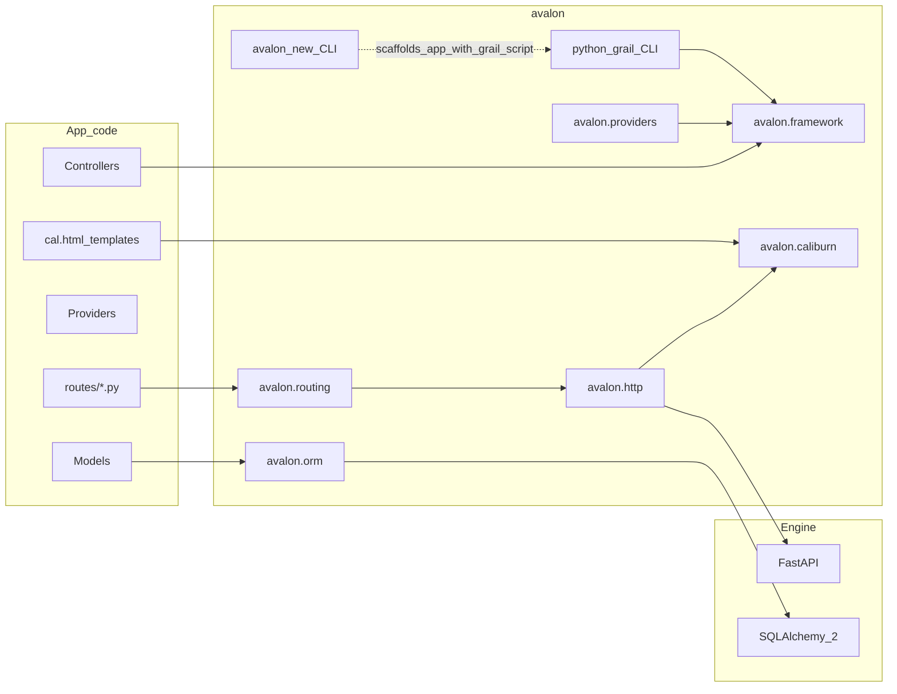

# Avalon — Canonical Plan

> **Status:** Binding. This document is the source of truth for architecture and milestones.
> Change it deliberately (PR / explicit decision), not casually mid-implementation.
> Last aligned: 2026-09-03 (M2 Request/controller capture parity complete; exhaust = full parity).

## Working identity

- **Project / repo / distribution:** `avalon` (PyPI: `avalon`)
- **Import root:** `avalon` with intentional **subpackages**
- **CLIs (Laravel parallel):**
  - **`avalon new <app>`** — installer / project creator (like `laravel new`) — `avalon.installer`
  - **`python grail …`** — in-app commands via a root `grail` script (like `php artisan …`) — `avalon.grail`
  - Do **not** use Grail for project creation; do **not** use `avalon` for day-to-day app commands
- **HTTP engine:** FastAPI on Starlette (ASGI) — hidden behind Avalon’s programming model, with an escape hatch to the underlying FastAPI app for advanced cases
- **Validation / OpenAPI:** Pydantic v2 via Form Request–style classes
- **Views:** **Caliburn** (`avalon.caliburn`) — Blade-familiar syntax, featherweight render path, templates as **`.cal.html`**
- **Theme:** Arthurian naming for products/tools (`grail`, `Caliburn`); keep public APIs Laravel-familiar (`Route`, `Controller`, `Middleware`, `config()`, `@extends`)

## Design picture (target DX)

Developers create apps with `avalon new`, then run `python grail …` inside the app (controllers, providers, `routes/`, `config/`). Avalon boots a service container, registers providers, compiles routes into FastAPI, and serves via Uvicorn. FastAPI/Starlette remain implementation details of the HTTP kernel. Views compile Caliburn templates (`.cal.html`) to fast Python callables.



## Package layout

```text
avalon/
  pyproject.toml
  src/avalon/
    framework/                 # Application, container, boot lifecycle
    config/                    # config repository, env
    providers/                 # core service providers + Provider base
    http/                      # kernel, request, response, middleware, controllers
    routing/                   # Route DSL → FastAPI bridge
    validation/                # FormRequest
    grail/                     # in-app CLI (python grail …)
    installer/                 # avalon new …
    orm/                       # M4
    caliburn/                  # M5 — optional for API apps
    auth/                      # M6
  tests/
  examples/
  docs/
```

**Import examples:**

- `from avalon.framework import Application`
- `from avalon.routing import Route`
- `from avalon.http import Controller, Middleware`
- `from avalon.providers import ServiceProvider`
- `from avalon.validation import FormRequest`
- later: `from avalon.orm import Model`
- later: `from avalon.caliburn import ViewFactory`

### Subpackage boundaries

| Subpackage | Responsibility |
| --- | --- |
| `avalon.framework` | Application, IoC container, boot |
| `avalon.config` | `.env`, config files, `config()` |
| `avalon.providers` | Provider base + framework providers |
| `avalon.http` | Kernel, request/response, middleware, base controller |
| `avalon.routing` | Route definitions, groups, compiling onto FastAPI |
| `avalon.validation` | FormRequest / validation errors |
| `avalon.grail` | In-app CLI (`python grail …`) |
| `avalon.installer` | Installer CLI (`avalon new`) |
| `avalon.orm` | Eloquent-like ORM (M4) |
| `avalon.caliburn` | Caliburn compiler/runtime (M5) |
| `avalon.auth` | Guards, middleware (M6) |

## Ecosystem growth

Start as **one installable `avalon`**. When Caliburn, kits, or queues get large:

1. **Same repo, optional extras** — e.g. `pip install avalon[caliburn]`, or
2. **Monorepo of distributions** still under the `avalon.*` namespace, plus starter-kit packages

Do **not** rename the project to `avalon_framework`. “Framework” is the `avalon.framework` subpackage.

**Rules:**

- Core happy path must not require Caliburn; API apps never import `avalon.caliburn`
- `avalon.caliburn` stays framework-light and dependency-thin; integrate via a view provider
- Starter kits and heavy subsystems stay out of the default import surface
- App code uses `avalon.*` only — no FastAPI imports on the happy path

## Decision: ORM (Eloquent-like)

**Chosen approach:** Eloquent-shaped **Active Record + Query Builder API** as `avalon.orm`, façade over **SQLAlchemy 2.0 (async-first)**.

**Public DX targets:**

- `User.query().where("email", email).first()`
- `Post.query().with_("author", "comments").find(1)`
- `user.posts().where("published", True).get()`
- model events, casts, soft deletes, scopes
- migrations via Alembic under `python grail migrate` UX

**Internal rule:** App code depends on `avalon.orm`, not SQLAlchemy — except documented escape hatches.

## Decision: Views — Caliburn

| Item | Choice |
| --- | --- |
| Product name | Caliburn |
| Package | `avalon.caliburn` |
| Template extension | **`.cal.html`** |
| Inline code | **`@python` / `@endpython` only** (no freeform Python embedding) |
| DX north star | Blade-familiar directives (Edge-style iteration) |
| Performance north star | **Featherweight** — first-class constraint |

Logic belongs in controllers, view models, and composers. `@python` is an escape hatch, not the default style.

### Performance principles (non-negotiable)

- **Compile ahead, render thin** — no re-lex/parse on the request path
- **Aggressive compiled-cache** — mtime invalidate in dev; warm cache in prod
- **Minimal runtime** — thin dependency graph on the hot path
- **Zero-cost unused features**
- **Benchmark from MVP** — echo, layout+sections, foreach; regression guards
- **Compare honestly** — Caliburn vs Jinja2 on shared fixtures

### Iteration ladder

1. **MVP:** `{{ }}`, `{!! !!}`, `@extends` / `@section` / `@yield`, `@include`, `{{-- --}}`
2. **Control flow:** `@if`, `@unless`, `@foreach`, `@forelse`, `@for`, `@while`, `@python`
3. **Components:** `@component` / `<x-*>`, slots, attributes
4. **Framework directives:** `@csrf`, `@auth`, `@guest`, `@error`, asset helpers
5. **Advanced:** composers, creators, fragment caching, custom `@directive`

## Decision: Scope discipline

Bite-sized milestones. **No** queues, notifications, scheduler, mail, or seeders until the core path is boring and tested. Seeders follow ORM maturity. Caliburn is its own track after the core gate.

**Exhaust means full parity within the milestone’s declared scope.** Do not ship thin placeholders that claim a feature is done. Iterate inside the milestone (API + tests + living example) until the Laravel/Adonis-class DX for that slice is real, then move on. “Optional if light” / partial façades are not an exit criteria.

## Decision: Production serving (ASGI)

Avalon apps are **plain ASGI**. There is no proprietary production server.

| Environment | How |
| --- | --- |
| Local | `python grail serve` → Uvicorn on `bootstrap.app:asgi` (dev reload; port walk 3000–3099) |
| Production | Uvicorn (or Gunicorn + Uvicorn workers / Hypercorn) on the same ASGI import path, behind a reverse proxy (Caddy / Nginx / Traefik) for TLS, compression, and optional static files |

**Rules:**

- App code never imports the process server; Grail/`uvicorn` are entrypoints only
- Production docs show workers + proxy; optional later: `python grail serve --workers N` (not required for M3)
- Static/asset CDN remains outside the Python process when possible; Avalon still generates correct public URLs (see subpath)

## Decision: Subpath hosting (first-class)

Laravel’s common failure mode — apps under `/apps/foo` with broken absolute `/…` assets and redirects — is **out of scope as a “proxy only” problem**. Avalon treats the public mount path as framework config.

| Config | Role |
| --- | --- |
| `APP_URL` | Canonical public origin (scheme + host[+port]), e.g. `https://example.com` |
| `APP_BASE_PATH` | Public path prefix, e.g. `/apps/foo` (empty or `/` = site root) |

**Contract (binding):**

1. **URL helpers** (`url()`, `route()`, `redirect()`, asset helpers) always honor `APP_BASE_PATH`
2. **Router / ASGI** either compile routes under the prefix or mount the ASGI app at it — one mechanism, documented; no double-prefix bugs
3. **Trusted proxies** (`X-Forwarded-Proto` / `Host` / `Prefix` as configured) so generated URLs match the public edge
4. **Caliburn asset helpers** (M5) must be prefix-aware from day one — never bake root-absolute asset paths that ignore `APP_BASE_PATH`

**Milestone homes:** design locked here; implement URL helpers with full `APP_URL` / `APP_BASE_PATH` behavior when redirects/links first appear (still before Caliburn assets); full mount + asset proof with Caliburn (M5). Do not ship Caliburn assets without subpath tests.

## Decision: Router DX beyond core verbs

**M2 delivered:** `get` / `post` / `put` / `patch` / `delete` / `options` / `any` / `match` + groups (prefix, middleware).

**Deferred (do not reopen M2):**

| Item | Home |
| --- | --- |
| `head`, `redirect` / `permanentRedirect`, `fallback`, named `route()` helper | Small DX pass after M3 (or end of M3 if `make:*` is light) |
| `resource` / `apiResource` | When CRUD scaffolding needs them (post-M4 or with API starter) |
| `view` routes | Caliburn (M5) |

## Decision: Security roadmap

M2 shipped the middleware **pipeline** only — empty default stack. Security is **not** implied by M2.

| Concern | Approach | Milestone home |
| --- | --- | --- |
| Security headers (CSP baseline, `X-Frame-Options`, `Referrer-Policy`, etc.) | Default middleware pack; config knobs in `config/http.py` | After M3 / with web hardening — no session dependency |
| CORS | Config + middleware for API apps | Same hardening pass |
| CSRF | Token + session; Caliburn `@csrf` | With sessions (M6 or dedicated web-security slice immediately before/with M6) |
| Cookie signing / encryption | Session / cookie stack | M6 |
| XSS escaping | `{{ }}` escaped vs `{!! !!}` raw | Caliburn M5 |
| CSP nonces | Tied to view rendering | Caliburn M5 ladder (framework directives) |
| Trusted proxies | Request / URL generation | With subpath helpers |
| Rate limiting | Optional middleware | Later |
| `auth` / `guest` | Guards | M6 |

**Rules:**

- Do **not** ship CSRF theater without a real session store
- Default **web** middleware should be secure-by-default once the web stack exists; API scaffolds may omit CSRF
- Exhaust one milestone at a time — do not fold this whole table into M3

## Decision: Request capture (Laravel parity)

`avalon.http.Request` is the app-facing request type. Controllers must not need Starlette/FastAPI request types.

| Concern | Contract |
| --- | --- |
| Hydration | Kernel builds `Request` via `await Request.create(...)` once per request (query + JSON/form body + files) |
| `all()` / `input()` | Query **merged with** body; **body wins**; route params are **not** included |
| `query()` / `post()` / `json()` | Query-only, body-only, parsed JSON |
| `route()` | Path parameters |
| Selection | `only()`, `except_()` (Laravel `except`), `keys()`, `has`, `has_any`, `filled`, `missing` |
| Coercion | `boolean()`, `integer()`, `float()`, `string()` |
| Mutation | `merge()`, `replace()` (middleware-friendly) |
| Files | `UploadedFile`, `file()`, `files()`, `has_file()` |
| Meta | `method`, `path`, `url`, `headers`, `cookies`, `header()`, `cookie()`, `bearer_token()`, `ip()`, `user_agent()`, `is_method()`, `is_json()` |
| Controller injection | `Request` by type/name; route params by name; other type hints via container `make()` |
| Validation | **`FormRequest` (M3)** — not ad-hoc `$request->validate()` on the base Request for M2 exit |

**M2 is closed** when this table is implemented, tested, and exercised in `examples/progress` (done).

## Milestones

### M0 — Skeleton — **complete**

- Repo/project `avalon`, installable distribution `avalon`
- Subpackage stubs: `framework`, `config`, `providers`, `http`, `routing`, `validation`, `grail`, `installer`, plus placeholders for `orm`, `caliburn`, `auth`
- Root `grail` script: `python grail version` works
- **`avalon new <name>`** scaffolds a Laravel-like app tree (incl. root `grail`, `bootstrap/app.py`, controllers, routes, config)
- **`python grail serve`** runs Uvicorn against `bootstrap.app:asgi` (M0 minimal FastAPI entry; Avalon HTTP kernel replaces this in M2)
- pytest harness + GitHub Actions CI (Python 3.11–3.13)
- Smoke plan: [`docs/SMOKE.md`](SMOKE.md); automated suite under `tests/smoke/`
- Coverage gate: **≥ 95%** (`pytest-cov`, enforced in CI; raise later)

### M1 — Application kernel — **complete**

- `Application.bootstrap()`: env → config → register providers → boot
- `.env` loader (`load_environment` / `env()`) and `ConfigRepository` + `config()`
- Service container: bind / singleton / instance / alias / resolve / `make` / constructor autowiring
- `ServiceProvider` + `FoundationServiceProvider`; `app.providers` from `config/app.py`
- Scaffolded apps boot the kernel from `bootstrap/app.py`
- Living example: [`examples/progress`](../examples/progress) (milestone board at `/progress`)
- Smoke: [`docs/SMOKE.md`](SMOKE.md) M1 section + `tests/smoke/test_m1_smoke.py`

### M2 — HTTP + routing — **complete**

- Router DSL: `Route.get/post/...`, groups, prefixes, middleware aliases
- Controllers resolved from the container; async actions
- Middleware pipeline (`handle(request, next)`) with `config/http.py` aliases
- `HttpKernel` compiles Avalon routes onto FastAPI (engine stays hidden)
- **`Request` Laravel-parity input bag + controller capture** (see Decision above)
- `HttpException` JSON shape `{message, status, errors?}`
- App bootstrap: `asgi = application.asgi` — **no FastAPI imports in app code**
- Smoke/regression: `tests/smoke/test_m2_smoke.py`, `tests/regression/test_m2_contracts.py`
- Living example: `/demo/*` exhausts verbs, middleware, Request bag, container DI
- **Out of scope for M2:** production workers UX, `APP_BASE_PATH` mount, CSRF/CSP packs, `resource`/`view` routes, FormRequest

### M3 — Validation + DX

- `FormRequest` (Pydantic) with Laravel-ish failure messages
- Exception handler polish as needed for validation failures
- `python grail make:controller`, `make:middleware`, `make:provider`, `make:request`
- Example API app proving the loop
- URL helpers with full `APP_URL` + `APP_BASE_PATH` behavior when redirects/links appear (mount/asset proof still M5)

**Gate:** Example boots, routes, injects, validates, responds — no FastAPI imports in app code.

### M4 — `avalon.orm`

- Model base, query builder, CRUD, relationships, scopes, casts
- SQLAlchemy 2 async via provider
- `python grail make:model`, migrate commands
- Soft deletes + model events (subset)

### M5 — Caliburn (`avalon.caliburn`)

- MVP: `.cal.html`, layouts + echo + include, compile-to-Python + cache
- Wire `view()` via provider; optional extra `avalon[caliburn]`
- Benchmark suite from day one; continue parity ladder without blocking auth
- **Subpath:** asset helpers + smoke that an app under `APP_BASE_PATH` serves correct asset/URLs
- XSS defaults: escaped `{{ }}` vs raw `{!! !!}`

### M6 — `avalon.auth`

- Session + token guards
- Middleware `auth`, `guest`
- CSRF (with sessions) + cookie signing; Caliburn `@csrf` / `@auth` / `@guest` as directives land

### Later (deferred)

- Queues / jobs, mail, notifications, scheduler
- Seeders/factories
- Policies/gates, broadcasting
- Starter kits
- Full Caliburn advanced parity (ongoing on M5 track)
- Router DX sugar: `head`, `redirect`, `fallback`, `route()`, then `resource` / `apiResource`
- Default security-headers + CORS middleware pack (post-M3 hardening; before or with M6 web stack)
- Production docs / optional `grail serve --workers`

## Quality bar for “solid core”

- Type hints + tests per subpackage boundary
- Canonical `examples/api` updated every core milestone
- Docs per milestone: mental model + FastAPI mapping under the hood
- Stable `avalon.*` imports; no Starlette/FastAPI types in happy-path app code
- Caliburn: golden fixtures + render benchmarks with regression guards
- **Coverage ≥ 95%** on `avalon` (CI fail-under on full suite; smoke runs without coverage)
- Milestone smoke + regression contracts (see [`SMOKE.md`](SMOKE.md)); `make smoke` / `make regression` / `make test-cov`

## Next implementation focus

**M3 only** — Validation + DX (`FormRequest`, `python grail make:*`, validation failure shape). M0–M2 are closed under the exhaust/full-parity rule.

Do **not** pull full subpath mounting, CSRF, or CSP into M3 beyond what their decisions allow.
