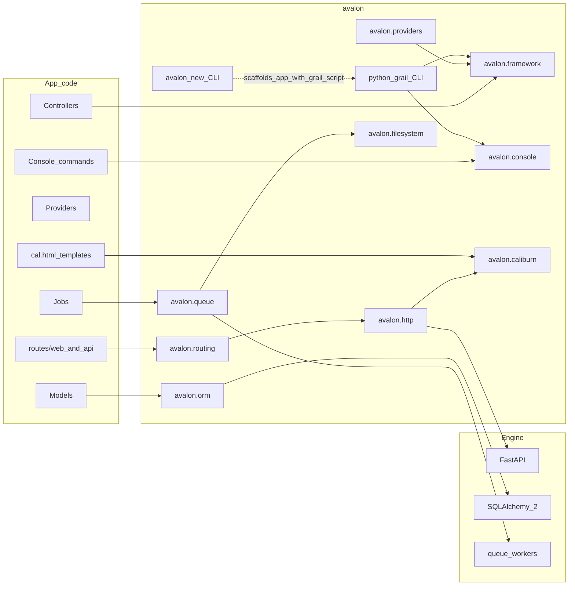

# Avalon — Canonical Plan

> **Status:** Binding. This document is the source of truth for architecture and milestones.
> Change it deliberately (PR / explicit decision), not casually mid-implementation.
> Last aligned: 2026-09-04 (M5 complete; docs versions / factories / REPL clarified).

## Working identity

- **Project / repo / distribution:** `avalon` (PyPI: `avalon`)
- **Import root:** `avalon` with intentional **subpackages**
- **CLIs (Laravel parallel):**
  - **`avalon new <app>`** — installer / project creator (like `laravel new`) — `avalon.installer`
  - **`python grail …`** — in-app commands via a root `grail` script (like `php artisan …`) — `avalon.grail`
  - Do **not** use Grail for project creation; do **not** use `avalon` for day-to-day app commands
- **HTTP engine:** FastAPI on Starlette (ASGI) — hidden behind Avalon’s programming model, with an escape hatch to the underlying FastAPI app for advanced cases
- **Validation / OpenAPI:** Pydantic v2 via Form Request–style classes
- **Views:** **Caliburn** (`avalon.caliburn`) — Blade-familiar syntax, featherweight render path, templates as **`.cal.html`**
- **Theme:** Arthurian naming for products/tools (`grail`, `Caliburn`); keep public APIs Laravel-familiar (`Route`, `Controller`, `Middleware`, `config()`, `@extends`)
- **App layout naming:** Python snake_case packages/modules (`app/models/post.py`); PascalCase **classes** and Laravel-shaped directory *roles* (`models`, `http/controllers`). See [Directory Structure](../website/src/content/docs/structure.md).

## Design picture (target DX)

Developers create apps with `avalon new`, then run `python grail …` inside the app (controllers, providers, `routes/`, `config/`). Avalon boots a service container, registers providers, compiles routes into FastAPI, and serves via Uvicorn. FastAPI/Starlette remain implementation details of the HTTP kernel. Views compile Caliburn templates (`.cal.html`) to fast Python callables.



## Package layout

```text
avalon/
  pyproject.toml
  src/avalon/
    framework/                 # Application, container, boot lifecycle
    config/                    # config repository, env
    providers/                 # core service providers + Provider base
    http/                      # kernel, request, response, middleware, controllers
    routing/                   # Route DSL → FastAPI bridge
    validation/                # FormRequest
    translation/               # M4 — translator, plurals, Number, lang tooling
    grail/                     # in-app CLI entry (python grail …)
    exceptions/                # M8 — handler, debug page, error rendering
    log/                       # M8 — channels, log()
    console/                   # M9 — commands, scheduling
    filesystem/                # M10 — disks / FlySystem-shaped Storage
    queue/                     # M11 — jobs, workers, failed jobs
    installer/                 # avalon new …
    orm/                       # M5
    caliburn/                  # M6 — optional for API apps
    auth/                      # M7
  tests/
  examples/
  docs/
```

**Import examples:**

- `from avalon.framework import Application`
- `from avalon.routing import Route`
- `from avalon.http import Controller, Middleware`
- `from avalon.providers import ServiceProvider`
- `from avalon.validation import FormRequest`
- `from avalon.translation import __, trans, trans_choice, Number, Lang`
- `from avalon.orm import Model`
- later: `from avalon.caliburn import ViewFactory`
- later: `from avalon.exceptions import Handler`
- later: `from avalon.log import log`
- later: `from avalon.console import Command, schedule`
- later: `from avalon.filesystem import Storage`
- later: `from avalon.queue import Job, dispatch`

### Subpackage boundaries

| Subpackage | Responsibility |
| --- | --- |
| `avalon.framework` | Application, IoC container, boot |
| `avalon.config` | `.env`, config files, `config()` |
| `avalon.providers` | Provider base + framework providers |
| `avalon.http` | Kernel, request/response, middleware, base controller |
| `avalon.routing` | Route definitions, groups, compiling onto FastAPI |
| `avalon.validation` | FormRequest / validation errors |
| `avalon.translation` | Translator, `lang/` catalogs, `__()` / `trans()` / `trans_choice()`, namespaces, Number/date helpers, locale resolution (M4) |
| `avalon.grail` | In-app CLI entrypoint (`python grail …`) — thin Typer surface over console kernel |
| `avalon.exceptions` | Handler (`report`/`render`), debug page, error views (M8) — distinct from `avalon.http.exceptions`, which holds the `HttpException` classes |
| `avalon.log` | Log channels + `log()` helper (M8) |
| `avalon.console` | Command base, discovery, scheduler (M9) |
| `avalon.filesystem` | Disks, Storage façade, FlySystem-shaped drivers (M10) |
| `avalon.queue` | Jobs, queues, workers, failed-job handling (M11) |
| `avalon.installer` | Installer CLI (`avalon new`) |
| `avalon.orm` | Eloquent-like ORM (M5) |
| `avalon.caliburn` | Caliburn compiler/runtime (M6) |
| `avalon.auth` | Guards, middleware (M7) |

## Ecosystem growth

Start as **one installable `avalon`**. When Caliburn, kits, filesystem drivers, or queues get large:

1. **Same repo, optional extras** — e.g. `pip install avalon[caliburn]`, or
2. **Monorepo of distributions** still under the `avalon.*` namespace, plus starter-kit packages

Do **not** rename the project to `avalon_framework`. “Framework” is the `avalon.framework` subpackage.

**Rules:**

- Core happy path must not require Caliburn; API apps never import `avalon.caliburn`
- `avalon.caliburn` stays framework-light and dependency-thin; integrate via a view provider
- Starter kits and heavy subsystems stay out of the default import surface
- App code uses `avalon.*` only — no FastAPI imports on the happy path

## Decision: ORM (Eloquent-like)

**Chosen approach:** Eloquent-shaped **Active Record + Query Builder API** as `avalon.orm`, built on **SQLAlchemy 2.0 Core (async-first)**.

**Parity target:** full Eloquent parity — models, query builder, every relationship type, eager loading, collections, casts, accessors/mutators, scopes, soft deletes, events/observers, pagination, transactions, and migrations. M5 is **not** a subset; it exhausts this contract.

**Core over ORM (binding):** Avalon uses SQLAlchemy **Core** (expression language, dialects, pooling, async engine) and implements Active Record itself. SQLAlchemy's declarative/Session unit-of-work is deliberately **not** used — it contradicts Active Record semantics (identity map, flush ordering, detached instances) and would leak through the DX. This keeps `avalon.orm` in control of the model lifecycle.

**Async-first (binding):** Every query/persistence operation is awaited, because Avalon runs on ASGI:

```python
user = await User.query().where("email", email).first()
posts = await Post.query().with_("author", "comments").find(1)
published = await user.posts().where("published", True).get()
```

Sync Eloquent-style calls are **not** offered — a hidden sync bridge under async is a footgun, not DX.

**Internal rule:** App code depends on `avalon.orm`, not SQLAlchemy — except documented escape hatches (`DB.raw`, `DB.connection().execute`).

### Parity ladder (all in M5)

1. **Connections:** `config/database.py`, multiple connections, SQLite / PostgreSQL / MySQL+MariaDB / SQL Server (Laravel first-party set) plus optional Oracle, `DB` façade, raw queries, transactions (+ nested via savepoints)
2. **Model:** table/key inference, `fillable`/`guarded` + `MassAssignmentException`, `casts`, defaults, accessors/mutators, dirty tracking (`is_dirty` / `get_changes` / `get_original`), timestamps, `hidden`/`visible`/`appends`, `to_dict`/`to_json`, `save`/`update`/`delete`/`refresh`/`replicate`/`is_`
3. **Builder:** full `where` family (in / null / between / date parts / column / like / nested closures / or-variants), ordering, grouping + having, limit/offset, select + distinct + raw, joins, aggregates, `pluck`/`value`, `exists`, `find_or_fail`, `first_or_create`, `update_or_create`, `increment`/`decrement`, dialect-native `upsert` (SQLite/PG `ON CONFLICT`, MySQL `ON DUPLICATE KEY`; probe fallback otherwise), `chunk`/`cursor`/`each`, `when`/`unless`, `to_sql`
4. **Relationships:** `has_one`, `has_many`, `belongs_to`, `belongs_to_many` (pivot columns, `attach`/`detach`/`sync`/`toggle`), `has_one_through`, `has_many_through`, polymorphic (`morph_one`, `morph_many`, `morph_to`, `morph_to_many`, `morphed_by_many`)
5. **Eager loading:** `with_` (nested + constrained), `with_count`, lazy `load` / `load_missing`, `has` / `doesnt_have` / `where_has` / `where_doesnt_have`
6. **Collections:** Eloquent-shaped `Collection` returned from every multi-row read
7. **Scopes & lifecycle:** local scopes, global scopes, soft deletes (`trashed` / `with_trashed` / `only_trashed` / `restore` / `force_delete`), model events + observers
8. **Pagination:** `paginate` / `simple_paginate` with a JSON-serializable paginator
9. **Migrations:** Schema builder (`Schema.create` + `Blueprint`) over SQLAlchemy DDL; ordered Python migration files + a `migrations` table (not Alembic revisions); `make:model` (+`-m`), `make:migration` with Laravel TableGuesser name inference (create/update/blank stubs + StudlyCase class from slug), `migrate`, `migrate:rollback`, `migrate:fresh`, `migrate:status`. **Column modifiers (shipped):** chain on the creation line — `nullable()`, `default(...)`, `unique()`, **`index()`**, `primary()`, `after` / `before` (MySQL/MariaDB), `constrained()` — matching Laravel `$table->string('email')->index()`. Table-level `index([...])` / `unique([...])` also ship.
10. **Seeders:** `Seeder` with `call` / `call_with` / `call_silent` / `call_once` / `resolve` / invoke; `WithoutModelEvents`; `make:seeder`; `db:seed` / `migrate --seed` / `migrate:fresh --seed` (`--class` / `--seeder`); scaffold `DatabaseSeeder`. **Model factories are deferred** (see Later) — seeders must stay usable without them; factories later feed `DatabaseSeeder` the Laravel way (`User::factory()->count(10)->create()`).

**Rules:**

- N+1 must be *fixable*: eager loading is not optional polish, it ships with relationships.
- No SQLAlchemy types in app-facing signatures or return values.
- Mass assignment is guarded by default — `fillable` opt-in, never silently accept arbitrary input.
- Model events must fire for the documented lifecycle, including soft-delete restore.
- Migrations must round-trip: `migrate` → `migrate:rollback` returns the schema to its prior state.

**Deferred (declared, not M5):** database sessions/queue drivers (M11), model caching, read/write connection splitting, and **model factories** (see Later — explicit follow-on so seeders can grow into factory-backed demos).

## Decision: Documentation site (`website/`)

App-facing docs live in Astro Starlight under [`website/`](../website/). `PLAN.md` / `SMOKE.md` stay contributor contracts in `docs/`.

**Keep in plan (not blocking M6):**

1. **Major-version docs** — publish and switch among major Avalon versions (e.g. `1.x` / `2.x`) from the docs site, Laravel-style. Exact mechanics TBD (Starlight versioning, separate versioned content trees, or a thin version switcher); the requirement is that readers can open docs for the major they run.
2. **Prologue** — a top-level sidebar group (Laravel “Prologue”) holding **Release Notes / Changelog**, **Upgrade Guide**, and related orientation pages, versioned with the docs set above.
3. Changelogs and upgrade guides are **first-class docs content**, not only GitHub Releases prose.

Do not invent a second docs engine; extend the Starlight site.

## Decision: Views — Caliburn

| Item | Choice |
| --- | --- |
| Product name | Caliburn |
| Package | `avalon.caliburn` |
| Template extension | **`.cal.html`** |
| Inline code | **`@python` / `@endpython` only** (no freeform Python embedding) |
| DX north star | Blade-familiar directives (Edge-style iteration) |
| Performance north star | **Featherweight** — first-class constraint |

Logic belongs in controllers, view models, and composers. `@python` is an escape hatch, not the default style.

### Performance principles (non-negotiable)

- **Compile ahead, render thin** — no re-lex/parse on the request path
- **Aggressive compiled-cache** — mtime invalidate in dev; warm cache in prod
- **Minimal runtime** — thin dependency graph on the hot path
- **Zero-cost unused features**
- **Benchmark from MVP** — echo, layout+sections, foreach; regression guards
- **Compare honestly** — Caliburn vs Jinja2 on shared fixtures

### Iteration ladder

1. **MVP:** `{{ }}`, `{!! !!}`, `@extends` / `@section` / `@yield`, `@include`, `{{-- --}}`
2. **Control flow:** `@if`, `@unless`, `@foreach`, `@forelse`, `@for`, `@while`, `@python`
3. **Components:** `@component` / `<x-*>`, slots, attributes
4. **Framework directives:** `@csrf`, `@auth`, `@guest`, `@error`, `@lang`, `@choice`, `__()`, asset helpers
5. **Advanced:** composers, creators, fragment caching, custom `@directive`

## Decision: Scope discipline

Bite-sized milestones. **No** queues, notifications, scheduler, or mail until the **HTTP + validation + i18n + ORM + views + auth** core path is boring and tested (through M7). Seeders ship with M5 ORM; **model factories follow later** (still binding — they are how seeders scale). Caliburn is its own track after the core gate. Error handling, console (incl. a Tinker-class REPL), filesystem, and queues are sketched as **M8–M11** so the roadmap is honest — they are not next work. Multi-version docs + Prologue stay on the docs track (see Documentation site decision).

**Localization is the one deliberate exception to “defer until needed.”** It sits at M4 because retrofitting translations across four message-producing layers costs far more than building them translatable. M4 exhausts **full Laravel localization parity** (not a thin core) — see the localization decision.

**Exhaust means full parity within the milestone’s declared scope.** Do not ship thin placeholders that claim a feature is done. Iterate inside the milestone (API + tests + living example) until the Laravel/Adonis-class DX for that slice is real, then move on. “Optional if light” / partial façades are not an exit criteria.

## Decision: Production serving (ASGI)

Avalon apps are **plain ASGI**. There is no proprietary production server.

| Environment | How |
| --- | --- |
| Local | `python grail serve` → Uvicorn on `bootstrap.app:asgi` (dev reload; port walk 3000–3099) |
| Production | Uvicorn (or Gunicorn + Uvicorn workers / Hypercorn) on the same ASGI import path, behind a reverse proxy (Caddy / Nginx / Traefik) for TLS, compression, and optional static files |

**Rules:**

- App code never imports the process server; Grail/`uvicorn` are entrypoints only
- Production docs show workers + proxy; optional later: `python grail serve --workers N` (not required for M3)
- Static/asset CDN remains outside the Python process when possible; Avalon still generates correct public URLs (see subpath)

## Decision: Subpath hosting (first-class)

Laravel’s common failure mode — apps under `/apps/foo` with broken absolute `/…` assets and redirects — is **out of scope as a “proxy only” problem**. Avalon treats the public mount path as framework config.

| Config | Role |
| --- | --- |
| `APP_URL` | Canonical public origin (scheme + host[+port]), e.g. `https://example.com` |
| `APP_BASE_PATH` | Public path prefix, e.g. `/apps/foo` (empty or `/` = site root) |

**Contract (binding):**

1. **URL helpers** (`url()`, `route()`, `redirect()`, asset helpers) always honor `APP_BASE_PATH`
2. **Router / ASGI** either compile routes under the prefix or mount the ASGI app at it — one mechanism, documented; no double-prefix bugs
3. **Trusted proxies** (`X-Forwarded-Proto` / `Host` / `Prefix` as configured) so generated URLs match the public edge
4. **Caliburn asset helpers** (M6) must be prefix-aware from day one — never bake root-absolute asset paths that ignore `APP_BASE_PATH`

**Milestone homes:** design locked here; **M3 shipped URL generation** (`url()` / `asset()` / `redirect()`). **ASGI mount at `APP_BASE_PATH` ships with the HTTP kernel** — `grail serve` serves the app under the prefix and redirects `/` → `{base}/`. Caliburn asset helpers (M6) must stay prefix-aware; do not regress the mount.

## Decision: Route files — web vs api

Scaffolded apps ship **`routes/web.py`** and **`routes/api.py`**. They are not interchangeable dumps of the same handlers.

| File | Audience | Response | State | Middleware intent |
| --- | --- | --- | --- | --- |
| `routes/web.py` | Browsers | **HTML** (`text/html`) | **Stateful** (cookies / session once M7 exists) | Future `web` group: session, cookie encryption, CSRF |
| `routes/api.py` | Machines / SPAs / clients | **JSON** (`application/json`) | **Stateless** | Future `api` group: no session/CSRF; auth via token/bearer |

**Contract (binding; shipped in M2):**

1. Controllers registered in `web.py` return HTML (string / `html()` helper / later Caliburn `view()`). Do **not** default web routes to JSON dicts.
2. Controllers registered in `api.py` return JSON (dict/list / `json()`). Do **not** return HTML from API routes.
3. Framework does **not** auto-negotiate content type from `Accept` to paper over mixing the two files — put the route in the right file.
4. Until sessions land (M7), “stateful” on web means **cookie-capable HTML surface + reserved `web` middleware group**, not a fake session store.
5. Until Caliburn (M6), web HTML may be hand-built strings via `html()` — still HTML, not JSON-as-HTML.
6. `HttpException` on API stays JSON `{message, status, errors?}`. On web, prefer HTML error pages once views exist; until then a minimal HTML error body is acceptable for web-only routes.

**Known boundary:** `avalon.http.Response` is currently Starlette's `Response` re-exported so controllers can annotate HTML actions without importing Starlette. App code still imports `avalon.*` only. An Avalon-owned response object is a candidate for a later DX pass — only if it earns its keep.

**Middleware groups (shipped):** `config/http.py` declares empty `middleware_groups` shells; **`bootstrap/app.py`** registers aliases and fills `web` / `api` via `Application.configure().with_middleware(...)`. Route files still reference groups by name (`Route.group(middleware=["web"])`). The kernel expands group names into their members before resolving aliases, recursively, and raises on circular references. Session/CSRF content for `web` lands with M7; API throttling/CORS in the hardening pass.

**Living example rule:** Request-bag / verb demos that return structured data live under **`/api/…`**. Browser pages (`/`, progress board) live under **`web.py`** and render HTML.

## Decision: Router DX beyond core verbs

**M2 delivered:** `get` / `post` / `put` / `patch` / `delete` / `options` / `any` / `match`; per-route `middleware=` / `name=`; **`Route.group(prefix=, middleware=)`** as a context manager, **nestable** — prefixes concatenate and middleware accumulates outer→inner, stack pops on exit. Group middleware may name a **middleware group** (`web` / `api`) or an alias.

Group DX is deliberately **context-manager only**. Laravel's fluent `Route::middleware([...])->prefix(...)->group(...)` chain is not a goal; `with Route.group(...)` is the Pythonic shape and stays the one way to group.

`name=` is currently stored on `RouteDefinition` and passed to the engine, but nothing reads it back until the `route()` helper lands.

**Deferred (do not reopen M2):**

| Item | Home |
| --- | --- |
| `head`, `redirect` / `permanentRedirect`, `fallback`, named `route()` helper | Small DX pass after M3 (or end of M3 if `make:*` is light) |
| **Group options: `name=` (name prefixing), `controller=`, `domain=`, `where=` constraints, `without_middleware`** | Same post-M3 DX pass; `name=` should land with `route()` since they pair |
| `resource` / `apiResource` | When CRUD scaffolding needs them (post-M5 or with API starter) |
| `view` routes | Caliburn (M6) |

## Decision: Security roadmap

M2 shipped the middleware **pipeline + group mechanism** only — `web` and `api` default stacks are empty. Security is **not** implied by M2.

| Concern | Approach | Milestone home |
| --- | --- | --- |
| Security headers (CSP baseline, `X-Frame-Options`, `Referrer-Policy`, etc.) | Default middleware pack; config knobs in `config/http.py` | After M3 / with web hardening — no session dependency |
| CORS | Config + middleware for API apps | Same hardening pass |
| CSRF | Token + session; Caliburn `@csrf` | With sessions (M7 or dedicated web-security slice immediately before/with M7) |
| Cookie signing / encryption | Session / cookie stack | M7 |
| XSS escaping | `{{ }}` escaped vs `{!! !!}` raw | Caliburn M6 |
| CSP nonces | Tied to view rendering | Caliburn M6 ladder (framework directives) |
| Trusted proxies | Request / URL generation | With subpath helpers |
| Rate limiting | Optional middleware | Later |
| `auth` / `guest` | Guards | M7 |

**Rules:**

- Do **not** ship CSRF theater without a real session store
- Default **web** middleware should be secure-by-default once the web stack exists; API scaffolds may omit CSRF
- Exhaust one milestone at a time — do not fold this whole table into M3

## Decision: Request capture (Laravel parity)

`avalon.http.Request` is the app-facing request type. Controllers must not need Starlette/FastAPI request types.

| Concern | Contract |
| --- | --- |
| Hydration | Kernel builds `Request` via `await Request.create(...)` once per request (query + JSON/form body + files) |
| `all()` / `input()` | Query **merged with** body; **body wins**; route params are **not** included |
| `query()` / `post()` / `json()` | Query-only, body-only, parsed JSON |
| `route()` | Path parameters |
| Selection | `only()`, `except_()` (Laravel `except`), `keys()`, `has`, `has_any`, `filled`, `missing` |
| Coercion | `boolean()`, `integer()`, `float()`, `string()` |
| Mutation | `merge()`, `replace()` (middleware-friendly) |
| Files | `UploadedFile`, `file()`, `files()`, `has_file()` |
| Meta | `method`, `path`, `url`, `headers`, `cookies`, `header()`, `cookie()`, `bearer_token()`, `ip()`, `user_agent()`, `is_method()`, `is_json()` |
| Controller injection | `Request` by type/name; route params by name; other type hints via container `make()` |
| Validation | **`FormRequest` (M3)** — not ad-hoc `$request->validate()` on the base Request for M2 exit |

**M2 is closed:** this table is implemented, tested, and exercised in `examples/progress`.

## Decision: Localization (i18n)

i18n is **infrastructure, not a feature bolted on late**. It lands as **M4**, immediately after validation and before ORM, views, auth, and error pages — so every layer that produces user-facing text is born translatable instead of being retrofitted four times.

**Parity target:** everything Laravel ships on its [Localization](https://laravel.com/docs/localization) page plus the `Lang` / `Translator` surface and the localization-adjacent Number / date helpers. M4 is **not** a thin core with follow-ups — exhaust Laravel parity inside the milestone.

**Why early (binding rationale):** at the end of M3 the framework owns roughly 25 English strings, all in `avalon.validation` plus a few exception defaults. That is the entire retrofit cost today. Every later milestone (Caliburn views, auth messages, M8 error pages) multiplies it.

**Catalog layout** (Laravel-shaped, app-owned `lang/`):

```text
lang/
  en/
    validation.py      # framework message overrides (app wins)
    auth.py
    passwords.py
    pagination.py
    messages.py        # app strings
  sw/
    validation.py
    messages.py
  en.json              # flat "string as key" catalog
  sw.json
  vendor/
    some_package/
      en/
        messages.py    # app override of a package catalog
```

Python files return a `dict` (nested ok). JSON files are flat `str → str`. Both forms are first-class.

**Contract — translator:**

| Concern | Contract |
| --- | --- |
| Helpers | `__()` / `trans()` — dotted `file.key` for PHP-style catalogs; literal string key for JSON catalogs |
| Choice | `trans_choice()` / `Lang.choice()` — pipe plurals (`one\|other`), interval forms (`{0} none\|[1,19] some\|[20,*] many`), and **CLDR plural categories** via Babel (zero/one/two/few/many/other per locale) |
| Placeholders | Laravel `:name` replacement; case transforms `:Name` / `:NAME` / `:NaMe` mirror Laravel |
| Count placeholder | `:count` auto-injected by `trans_choice` |
| Locale | `APP_LOCALE` + `APP_FALLBACK_LOCALE`; `app.set_locale()` / `get_locale()` / `is_locale()`; **request-scoped** under ASGI |
| Fallback | missing key → fallback locale → return the key itself (never exception, never blank) |
| Introspection | `Lang.has(key)`, `Lang.has_for_locale(key, locale)` |
| Namespaces | `package::file.key`; packages register via `Lang.add_namespace(name, path)` |
| Vendor overrides | `lang/vendor/<package>/<locale>/…` wins over the package's own catalog |
| Loader surface | `add_path`, `add_json_path`, `add_lines` (runtime lines), matching Laravel's loader API |
| Missing keys | `Lang.handle_missing_keys_using(callback)` — optional app hook; default still returns the key |
| Loading | Catalogs load once and cache; reload in debug / on explicit clear |
| Locale resolution | `SetLocale` middleware: explicit `set_locale()` wins, then request signal (`Accept-Language` for `api`; session/cookie once M7 exists for `web`), then config default |
| Framework messages | Shipped `en` catalogs for `validation` (+ stubs for `auth` / `passwords` / `pagination`); apps override per key without forking the framework |
| Validation retrofit | M3 422/403 envelope and English wording stay **byte-identical** for `en`; messages resolve through the translator thereafter |

**Contract — localization helpers (Laravel-adjacent, in scope):**

| Concern | Contract |
| --- | --- |
| Numbers | `Number.format` / `percentage` / `currency` / `file_size` / `for_humans` — locale-aware via Babel; mirrors `Illuminate\Support\Number` |
| Dates | Setting the app locale also sets the active date locale (Babel/pendulum or equivalent) so formatted dates follow `APP_LOCALE` unless overridden |

**Contract — tooling:**

| Concern | Contract |
| --- | --- |
| Publish | `python grail lang:publish` — scaffolds `lang/` and publishes framework catalogs (Laravel `lang:publish`) |
| Make | `python grail make:lang <locale>` — empty locale tree for a new language |
| Missing | `python grail lang:missing [--locale=xx]` — reports keys present in the fallback but absent in the target |

**Rules:**

- The active locale is **request-scoped**. A process-wide mutable locale is a concurrency bug under ASGI — do not ship one.
- Missing keys must degrade visibly (return the key), not silently render blank.
- Framework strings must be overridable by apps without vendoring the framework catalog.
- Pluralization must be **locale-correct**, not English one/other pretending to be universal — **Babel is a binding dependency** for CLDR plural rules and Number/date formatting.
- `lang:*` / `make:lang` ship on the existing thin Typer `grail` surface (same pattern as M3's `make:*`); they do **not** wait for the M9 console kernel.
- Do not invent features Laravel does not ship (gettext / `.po`, locale-prefixed `/en/…` URLs as framework core).
- Do not fold Caliburn directives, ORM, or auth *copy* into M4 — M4 owns the translator; later milestones **consume** it. Caliburn **must** ship `@lang` / `@choice` / `__()` in views as part of M6's exhaust, wired to this translator.

**Explicitly deferred (not Laravel core i18n):**

| Item | Home |
| --- | --- |
| `@lang` / `@choice` / `__()` Caliburn directives | **M6** — required consumer of M4; not optional |
| Session/cookie locale persistence for `web` | **M7** — once sessions exist; M4 ships `Accept-Language` + explicit set |
| Locale-prefixed URLs (`/en/…`) | Not Laravel core; community pattern only if demand appears later |
| gettext / `.po` interop | Not Laravel; out of scope |

## Decision: Error handling (exceptions + logging)

Exception handling is a **layer**, not a side effect of the HTTP kernel. It gets its own milestone (**M8**) rather than being smuggled into validation or auth work.

**Shipped in M2 (locked, do not regress):**

- `HttpException` subclasses with `{message, status, errors?}`
- Conversion happens **inside** the middleware pipeline, so route middleware decorates error responses
- Unhandled exceptions → 500; message hidden unless `APP_DEBUG`

That is the floor. It is deliberately not a handler layer: there is no app-level hook, no reporting, no HTML error pages, no logging.

**Contract for M8:**

| Concern | Contract |
| --- | --- |
| App handler | `app/Exceptions/Handler.py`, resolved from the container, overridable; framework default when absent |
| Split | `report(exc)` — logging/telemetry side; `render(request, exc)` — response side |
| Suppression | `dont_report` list; `reportable()` / `renderable()` registration hooks |
| Per-exception hooks | Exception classes may define their own `report()` / `render()` |
| Negotiation | **Follows route polarity, not `Accept` guessing** — web routes render HTML error pages, api routes render the JSON envelope |
| Debug page | `APP_DEBUG` only: traceback with source excerpts, request/route/config context; **never** in production |
| Production pages | `resources/views/errors/{status}.cal.html` with a framework fallback for apps without Caliburn |
| Status mapping | Table mapping common framework/domain exceptions to HTTP status codes |
| JSON envelope | `{message, status, errors?}` is a **locked M2 contract** — M8 extends, never breaks it |
| Logging | `config/logging.py`, channels (`stack`, `single`, `daily`, `stderr`), levels, context; `log()` helper; `report()` writes through it |

**Rules:**

- A debug page that leaks env/secrets in production is a security bug — gate it on `APP_DEBUG` and test the gate
- Do not ship `report()` without a real log destination; half a logging layer is exactly the placeholder this plan forbids
- Console-side exception rendering belongs to **M9** (console), not here
- Validation failures (M3) use the existing 422 envelope; M3 does **not** open the handler layer

## Milestones

### M0 — Skeleton — **complete**

- Repo/project `avalon`, installable distribution `avalon`
- Subpackage stubs: `framework`, `config`, `providers`, `http`, `routing`, `validation`, `grail`, `installer`, plus placeholders for `orm`, `caliburn`, `auth`
- Root `grail` script: `python grail version` works
- **`avalon new <name>`** scaffolds a Laravel-like app tree (incl. root `grail`, `bootstrap/app.py`, controllers, routes, config)
- **`python grail serve`** runs Uvicorn against `bootstrap.app:asgi` (M0 minimal FastAPI entry; Avalon HTTP kernel replaces this in M2)
- pytest harness + GitHub Actions CI (Python 3.11–3.13)
- Smoke plan: [`docs/SMOKE.md`](SMOKE.md); automated suite under `tests/smoke/`
- Coverage gate: **≥ 95%** (`pytest-cov`, enforced in CI; raise later)

### M1 — Application kernel — **complete**

- `Application.bootstrap()`: env → config → register providers → boot
- `.env` loader (`load_environment` / `env()`) and `ConfigRepository` + `config()`
- Service container: bind / singleton / instance / alias / resolve / `make` / constructor autowiring
- `ServiceProvider` + `FoundationServiceProvider`; `app.providers` from `config/app.py`
- Scaffolded apps boot the kernel from `bootstrap/app.py`
- Living example: [`examples/progress`](../examples/progress) (milestone board at `/progress`)
- Smoke: [`docs/SMOKE.md`](SMOKE.md) M1 section + `tests/smoke/test_m1_smoke.py`

### M2 — HTTP + routing — **complete**

- Router DSL: `Route.get/post/...`, nestable groups, prefixes, middleware aliases
- Controllers resolved from the container; async actions
- Middleware pipeline (`handle(request, next)`) with `config/http.py` defaults **and** Laravel 11-shaped registration in `bootstrap/app.py`: `Application.configure(...).with_middleware(...).create()` (`alias`, `web`/`api`/`group` append|prepend|replace, global `append`/`prepend`/`use`, **`trust_proxies` / `trust_hosts`**)
- `config/http.py` keeps empty group shells; app stacks, aliases, and proxy/host trust are registered in bootstrap (Progress demonstrates `demo.tag` this way)
- `HttpKernel` compiles Avalon routes onto FastAPI (engine stays hidden)
- **`Request` Laravel-parity input bag + controller capture** (see Decision above)
- `HttpException` JSON shape `{message, status, errors?}`, converted **inside** the pipeline so route middleware still decorates error responses
- **Route polarity:** `html()` + `Response` exported from `avalon.http`; scaffold ships HTML `routes/web.py` and JSON `routes/api.py`
- App bootstrap: `asgi = application.asgi` — **no FastAPI imports in app code**
- Smoke/regression: `tests/smoke/test_m2_smoke.py`, `tests/regression/test_m2_contracts.py`, `tests/test_m2_polarity.py`
- Living example: `/` + `/progress` render HTML; `/api/*` exhausts verbs, nested groups, Request bag, DI, exceptions

**Out of scope for M2 (unchanged):** production workers UX, `APP_BASE_PATH` mount, CSRF/CSP packs, `resource`/`view` routes, FormRequest, real sessions.

### M3 — Validation + DX — **complete**

- **`FormRequest`** on Pydantic v2: fields declared as annotations, schema built per subclass, `@field_validator` / `@model_validator` carried through
- Hooks: `authorize()` (false → 403), `prepare_for_validation()`, `passed_validation()`, `messages()`, `attributes()`, `validation_data()`
- Access: `data` (typed model), `validated(*keys)`, and proxying to the underlying `Request` for the full M2 input bag
- Kernel injects and validates before the action runs — invalid input never reaches controllers
- Laravel-shaped messages keyed by familiar rule names (`required`, `min`, `max`, `boolean`, `array`, `regex`, …), with string/collection size wording split as Laravel does
- Validation failures reuse the **locked 422 envelope** (`{message, status, errors}`) — M3 did **not** open the handler layer (that is M8)
- `python grail make:controller` / `make:middleware` / `make:provider` / `make:request` — nested namespaces, `__init__.py` creation, `--force`, duplicate + bad-name guards
- **URL generation:** `url()`, `asset()`, `redirect()`, `UrlGenerator` honoring `APP_URL` + `APP_BASE_PATH`; scaffolded apps and the living example use them for every link
- Living example: `POST /api/items` backed by `StoreItemRequest`
- Tests: `tests/test_m3_validation.py`, `test_m3_make.py`, `test_m3_urls.py`, `tests/smoke/test_m3_smoke.py`, `tests/regression/test_m3_contracts.py`

**Gate met:** example boots, routes, injects, validates, responds — no FastAPI imports in app code.

**Out of scope for M3:** exception handler layer + logging (M8), `route()` named-URL helper (post-M3 DX pass). ASGI mounting at `APP_BASE_PATH` is implemented on the HTTP kernel (see subpath decision).

### M4 — Localization (`avalon.translation`) — **complete**

Full Laravel localization parity before ORM/views/auth. See the decision above for the binding contract — M4 exhausts that contract, not a thin subset.

- `Translator` + `Lang` façade bound in the container; `__()` / `trans()` / `trans_choice()` exported from `avalon.translation`
- Catalog loading: `lang/<locale>/<file>.py` (nested dicts) + flat `lang/<locale>.json` (string-as-key); cached; `add_path` / `add_json_path` / `add_lines`
- Placeholders with Laravel case transforms (`:name` / `:Name` / `:NAME`); `:count` in choices
- Pluralization: pipe forms, interval forms (`{0}|[1,19]|[20,*]`), and **Babel CLDR** plural categories per locale
- Namespaces (`package::file.key`), vendor overrides (`lang/vendor/<package>/…`), `has` / `has_for_locale`, missing-key callback
- `APP_LOCALE` / `APP_FALLBACK_LOCALE`; `set_locale` / `get_locale` / `is_locale` — **request-scoped**
- `SetLocale` middleware (`Accept-Language` for `api`; explicit always wins)
- Localization helpers: `Number.format` / `percentage` / `currency` / `file_size` / `for_humans`; date locale follows app locale
- Tooling: `grail lang:publish`, `grail make:lang`, `grail lang:missing`
- **Retrofit:** `avalon.validation` messages resolve through the shipped `en` catalog (plus `auth` / `passwords` / `pagination` stubs); M3 422/403 envelope + `en` wording stay byte-identical
- Scaffold ships `lang/en/` + locale middleware; `avalon new` apps are translatable out of the box
- Living example: `/api/locale` answers in `en` / `sw` via `Accept-Language`

**Gate met:** dual-locale endpoint, CLI tooling, validation retrofit, coverage ≥ 95%.

### M5 — `avalon.orm` — **complete**

Full Eloquent parity — see the ORM decision above for the binding ladder. M5 exhausts it.

- Connections + `DB` façade + transactions (savepoint nesting); `config/database.py` (SQLite / PostgreSQL / MySQL+MariaDB / SQL Server + optional Oracle)
- `Model` base: casts, accessors/mutators, mass-assignment guard, dirty tracking, timestamps, serialization
- Query builder: complete `where` family (canonical `where("col", "=", val)`, two-arg `=` shortcut), joins, aggregates, chunking, `upsert`, `to_sql`
- All relationship types incl. through + polymorphic; eager loading, `with_count`, `where_has`
- `Collection` return type; `paginate` / `simple_paginate`
- Local + global scopes, soft deletes, model events + observers
- Schema builder over SQLAlchemy DDL; Python migrator (`make:model`, `make:migration` with name inference, `migrate` / `rollback` / `fresh` / `status`) — not Alembic revisions. Column-line modifiers include **`->index()`** / `->unique()` (and table-level `index` / `unique`)
- Seeders: `Seeder` call API, `WithoutModelEvents`, `make:seeder`, `db:seed` / `migrate --seed` / `migrate:fresh --seed`, scaffold `DatabaseSeeder` (factories deferred — see Later)
- Living example: `GET /api/orm` feature tour; `/api/posts` / `/api/users` cover eager load, scopes, soft deletes, pivot roles, morph comments, pagination, upsert
- Feature docs: [`website/…/articulate/`](../website/src/content/docs/articulate/) + [`database/`](../website/src/content/docs/database/)

**Gate met:** models, relations, migrator, seeders, coverage ≥ 95%.

### M6 — Caliburn (`avalon.caliburn`)

- MVP: `.cal.html`, layouts + echo + include, compile-to-Python + cache
- Wire `view()` via provider; optional extra `avalon[caliburn]`
- Replace hand-built web HTML strings with Caliburn where the example needs templates
- **i18n (required):** `@lang` / `@choice` / `__()` directives wired to `avalon.translation` — M4's translator is not optional for views
- Benchmark suite from day one; continue parity ladder without blocking auth
- **Subpath:** asset helpers + smoke that an app under `APP_BASE_PATH` serves correct asset/URLs
- XSS defaults: escaped `{{ }}` vs raw `{!! !!}`

### M7 — `avalon.auth`

- Session + token guards
- Middleware `auth`, `guest`
- Fill the reserved **`web`** middleware group: session start, cookie encryption, CSRF
- Keep **`api`** group stateless (token/bearer only)
- CSRF (with sessions) + cookie signing; Caliburn `@csrf` / `@auth` / `@guest` as directives land

### M8 — Error handling (`avalon.exceptions` + `avalon.log`)

Turns M2's minimal kernel behavior into a real handler layer. See the decision above for the binding contract.

- `Handler` base in `avalon.exceptions`; app override at `app/Exceptions/Handler.py`, resolved from the container
- `report()` / `render()` split, `dont_report`, `reportable()` / `renderable()` hooks
- Per-exception `report()` / `render()` methods honored before the handler default
- **Polarity-aware rendering:** HTML error pages for web routes, the locked JSON envelope for api routes
- `APP_DEBUG` debug page: traceback, source excerpts, request/route context — with a test proving it is off in production
- `resources/views/errors/{status}.cal.html` overrides plus a dependency-free framework fallback
- Logging slice: `config/logging.py`, channels (`stack`, `single`, `daily`, `stderr`), levels, context, `log()` helper
- Living example: a deliberate failure on a web route rendering HTML, the same failure on an api route rendering JSON

**Depends on:** M2 route polarity (done) and M6 Caliburn for error views. Do not start before M6 — HTML error pages without a view engine is exactly the placeholder trap.

### M9 — Console + scheduler (`avalon.console`)

Grail today is a thin Typer entry (`version`, `serve`, `make:*`, `migrate`, …). M9 turns it into a Laravel-shaped **console kernel**.

- `Command` base: signature / help / `handle()`, IoC-resolved
- Command discovery: `app/Console/Commands`, `python grail list`, `python grail make:command`
- Framework commands stay in `avalon.console`; app commands register via provider or auto-discover
- Input / output helpers (arguments, options, tables, confirm) — exhaust the DX, not a stub Typer wrapper
- **Scheduler:** `routes/console.py` or `app/Console/Kernel` schedule DSL (`daily`, `hourly`, `every_minute`, cron expressions)
- `python grail schedule:run` / `schedule:work` (long-running ticker) suitable for cron or a dedicated process
- Overlap / mutex for scheduled tasks (filesystem lock is enough until Redis/cache exists)
- Console-side rendering of uncaught exceptions, wired to the M8 handler
- **Interactive REPL (Tinker-class)** — a user-friendly Python shell with the app booted (container, facades, models, DB). Laravel parallel: `php artisan tinker`. **Product / command name TBD** (Arthurian; not locked — candidates live outside this contract until chosen). Requirements regardless of name: boot `Application` once, rich display (pretty repr / tables), optional `ipython`/`ptpython` when installed with a solid stdlib fallback, no raw “drop into bare `code.interact` and hope.” Ship as `python grail <name>` (or agreed alias).
- Living example: at least one app command + one scheduled task + a smoke that the REPL boots and can resolve a model / run a trivial query

**Depends on:** solid Application boot (done); M8 for console exception rendering. Does **not** require queues — scheduled closures/commands run in-process; queue integration is M11. The REPL may land with M9 or as a fast follow once the console kernel exists — it must not be forgotten.

### M10 — Filesystem (`avalon.filesystem`)

FlySystem-shaped **Storage** façade — app code never talks to raw `pathlib` for “disk” operations on the happy path.

- `Storage.disk("local")` / `Storage.put` / `get` / `exists` / `delete` / `copy` / `move` / `url` / `temporary_url` (where driver supports)
- Drivers: **local** (required), **S3-compatible** (optional extra), memory (tests)
- Config: `config/filesystems.py` — default disk, roots under `storage/app`, public disk + symlink story (`python grail storage:link`)
- Stream / large-file friendly APIs; visibility (`public` / `private`)
- Integrate with existing `Request` uploads (`UploadedFile` → `Storage`)
- Provider + `storage()` helper; smoke against local disk

**Depends on:** M2 request files (done). Natural prerequisite for queue failed-job payloads and mail attachments later.

### M11 — Queues + job workers (`avalon.queue`)

- `Job` base: `handle()`, `dispatch()`, delay, tries, backoff, timeout
- `ShouldQueue` vs sync dispatch; `dispatch_sync` escape hatch
- Queue connection drivers: **database** (after M5) and/or **Redis**; **sync** driver for tests/dev default
- `python grail queue:work` / `queue:listen` / `queue:retry` / `queue:failed`
- Failed jobs table/store + `failed()` hook on Job; failures report through the **M8** handler
- Middleware / job pipeline (rate limit, unique jobs — subset, exhaust what you claim)
- Horizon-class dashboard is **out of scope**; process supervision is docs (systemd / Docker)
- Living example: dispatch from a controller or command; worker processes the job

**Depends on:** M5 for database queue; M8 for failure reporting; M9 for `queue:*` commands; M10 nice-to-have for job artifacts.

### Later (still deferred)

- Mail, notifications, broadcasting
- **Model factories** (Eloquent/Laravel Factory parity) — `Factory` base, `definition()` / states / sequences, `make:factory`, `Model.factory()`, `create` / `make` / `count` / relationships; primary consumer is **seeders** (`DatabaseSeeder` + demo data). Homes after Articulate is boring in real apps; do not leave seeders as the permanent only way to fake rows.
- Policies/gates
- Starter kits (web kit vs API kit reflecting route polarity)
- Full Caliburn advanced parity (ongoing on M6 track)
- Router DX sugar: `head`, `redirect`, `fallback`, `route()`, then `resource` / `apiResource`
- Default security-headers + CORS middleware pack (post-M3 hardening; before or with M7 web stack)
- Production docs / optional `grail serve --workers`
- **Docs site:** major-version switching + **Prologue** (changelogs, upgrade guides, release notes) — see Documentation site decision
- Cache store (needed by schedule overlap upgrades + queue unique locks — introduce when first consumer needs it)

## Quality bar for “solid core”

- Type hints + tests per subpackage boundary
- Canonical `examples/api` updated every core milestone
- Docs per milestone: mental model + engine mapping in the Starlight site [`website/`](../website/) (write the page when the feature ships; `PLAN.md` stays the contract)
- Stable `avalon.*` imports; no Starlette/FastAPI types in happy-path app code
- Caliburn: golden fixtures + render benchmarks with regression guards
- **Coverage ≥ 95%** on `avalon` (CI fail-under on full suite; smoke runs without coverage)
- Milestone smoke + regression contracts (see [`SMOKE.md`](SMOKE.md)); `make smoke` / `make regression` / `make test-cov`

## Next implementation focus

**M6 only** — Caliburn (`avalon.caliburn`): `.cal.html` compiler, layouts, `view()`, `@lang`/`@choice` wired to M4. M0–M5 are closed under the exhaust/full-parity rule. App docs: `make docs` ([`website/`](../website/)).

Do **not** pull auth, error handling, console, filesystem, or queues into M6 beyond what their decisions allow.
